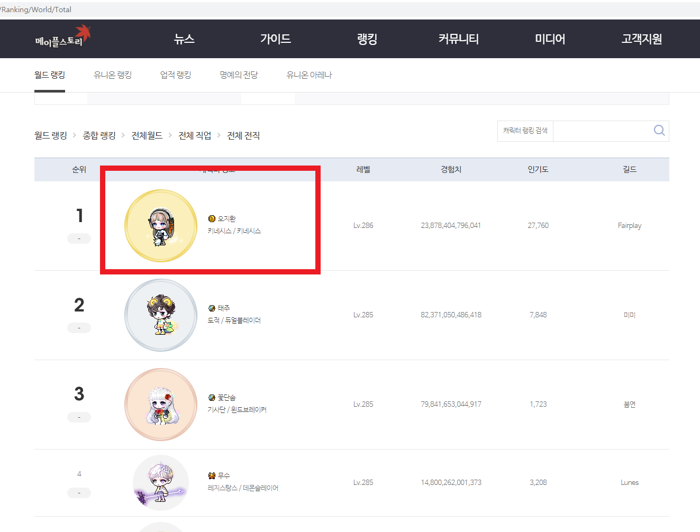
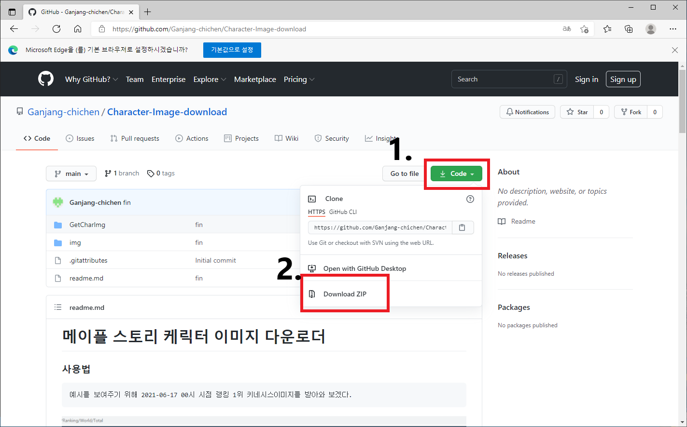
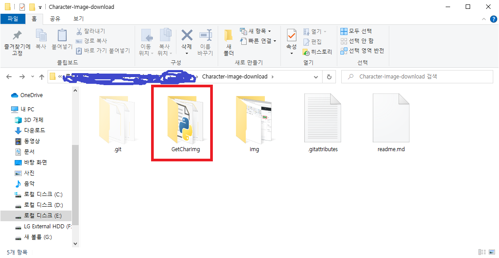
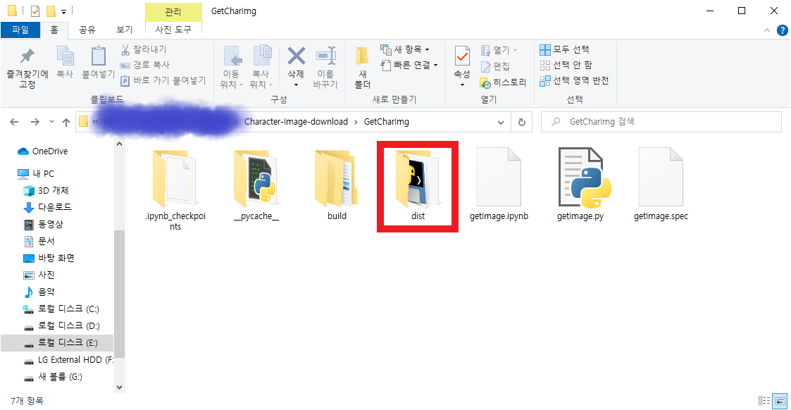
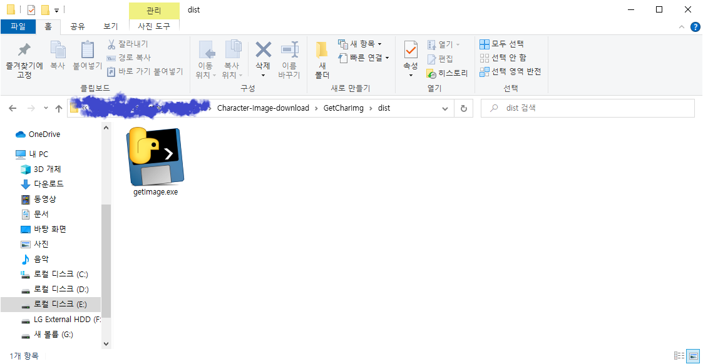
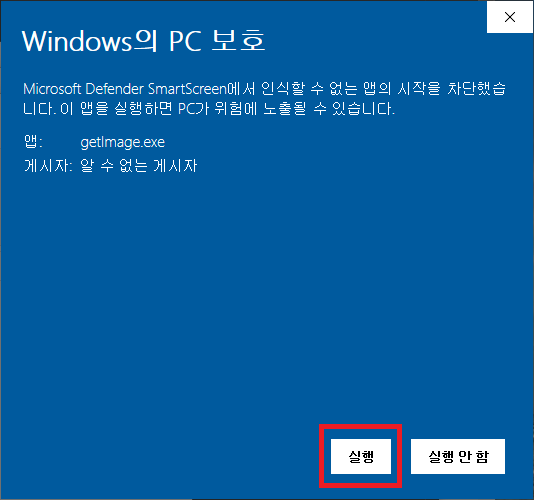
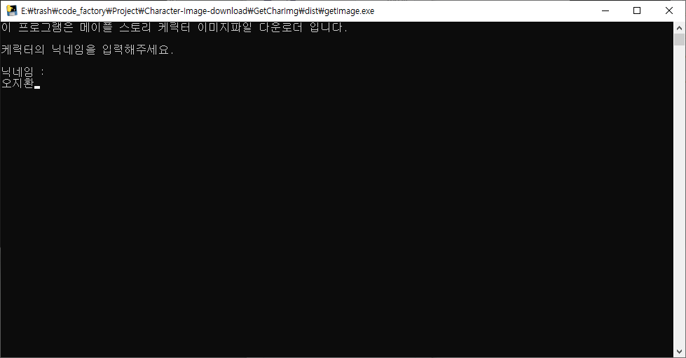
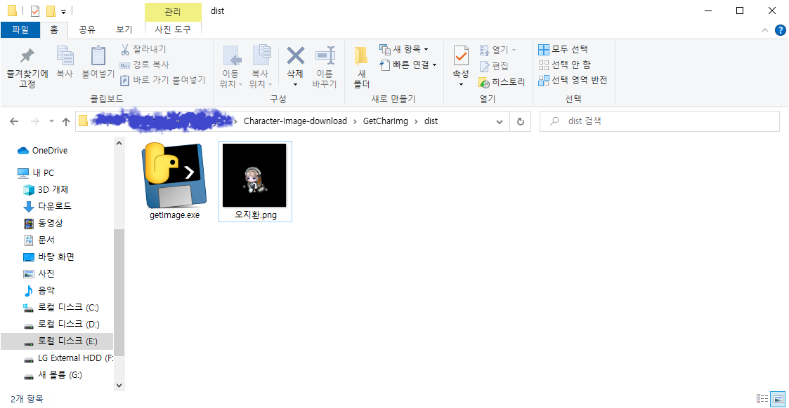
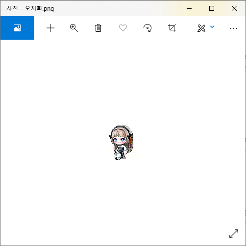

# 메이플 스토리 케릭터 이미지 다운로더

### 사용법

    예시를 보여주기 위해 2021-06-17 00시 시점 랭킹 1위 키네시스이미지를 받아와 보겠다.

    다운로드 방법.
    1. 클릭하고 2. 클릭하면 zip 파일이 다운로드 된다.
    압축을 해제하자.

    
    다운로드 받은 폴더에서 GetCharImg > dist 폴더로 들어가 준다.

    dist 폴더에서 getImage 실행파일을 실행시킨다.
    

    제작자가 개인적으로 만든 프로그렘임으로 윈도우에서 경고창이 뜰 수 있다.
    추가정보를 눌러 실행을 버튼을 누른다.

    다음의 터미널에서 다운로드 받고자 하는 케릭터 명을 입력한다.

    이미지가 다운로드 되었다.

